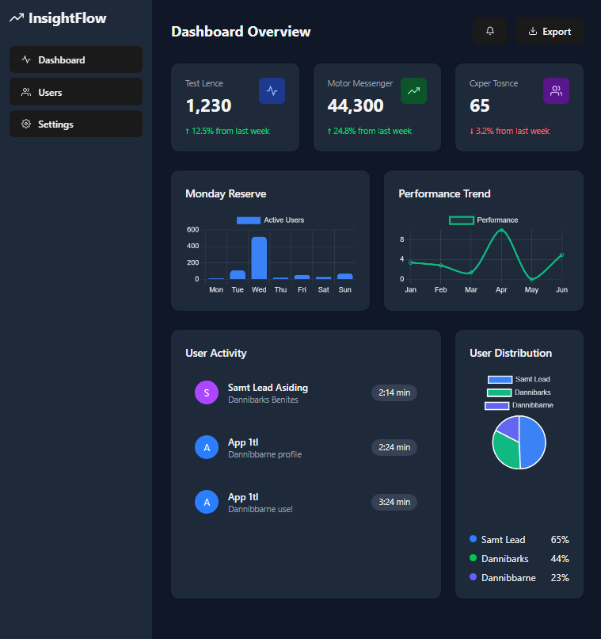

# InsightFlow Dashboard



A responsive admin dashboard with data visualization built with modern web technologies.

## Features

- Interactive charts (Bar, Line, Pie)
- Responsive layout for all devices
- Smooth animations
- Dark mode UI
- Sample analytics data
- Easy-to-customize components

## Technologies Used

- **Frontend**: React, Vite
- **Styling**: Tailwind CSS
- **Charts**: Chart.js
- **Animations**: Framer Motion

## Installation

1. Clone the repository:
   ```bash
   git clone https://github.com/your-username/insightflow.git
   cd insightflow
